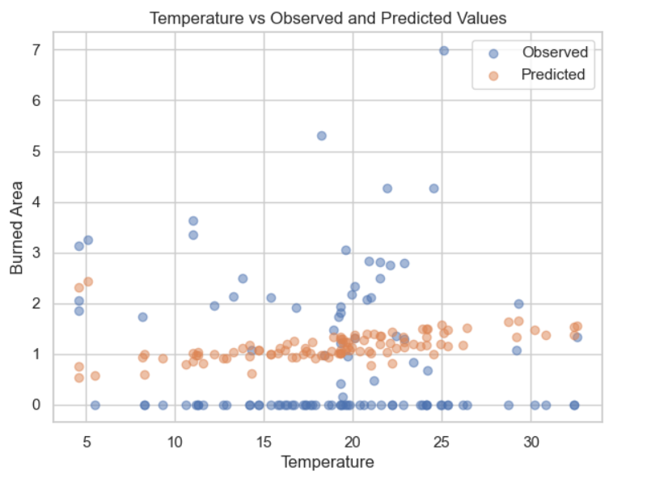

# Fire Damage Estimation

In this project, we will be working with a dataset containing information about forest fires in northeast Portugal. We are tasked with building a model that predicts the potential amount of damage future forest fires may cause. Our goal in this project is to use various techniques to optimize our model and achieve the highest predictive accuracy possible.

View this project live on Google Colab [here](https://colab.research.google.com/drive/1fqTBY7xgI8Eu3ljCTUABDPEujGpSSzAU?usp=sharing)
